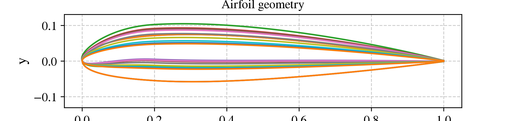
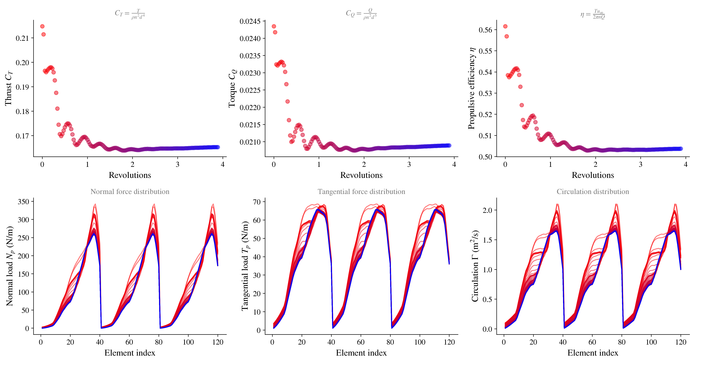

# vsp3-flowunsteady-pipeline

An automated Python pipeline that transfers parametric propeller geometry directly from **OpenVSP** into **FLOWUnsteady**, turning a `.bem`/`.vsp3` geometry pair into a ready-to-run, high-fidelity Julia simulation script — no manual re-modeling required.

---
## Recent Fixes & Validation (Oct 2026)

This pipeline was debugged end-to-end by comparing its output directly against
OpenVSP's native geometry (DegenGeom) and against VSPAERO's aerodynamic solve,
using a real 3-blade propeller as the test case. Four real bugs were found and
fixed in the conversion pipeline:

### Bugs fixed
1. **Feather-axis reference mismatch.** OpenVSP's `Rake`/`Skew` columns in the
   `.bem` export are referenced to the propeller's *feather axis*
   (`FeatherAxisXoC`, often not the leading edge), while FLOWUnsteady's
   `generate_rotor` expects `sweepdist`/`heightdist` referenced to the
   **leading edge**. The script now reads `FeatherAxisXoC`/`FeatherOffsetXoC`
   from the `.vsp3` and corrects for this automatically
   (`apply_feather_axis_correction`).
2. **Julia float/int type bug.** Whole-number `Float64` values (e.g.
   `blade_r = 1.0`) were being written into the generated `.jl` script as
   bare integers (`1`), which Julia parses as `Int64` — causing a
   `TypeError` in `generate_rotor`. Fixed in `_fmt()`.
3. **Chord-curve parsing failure.** The original chord-curve lookup assumed
   a `<ParmContainer Name="Chord">` spline block that doesn't exist in this
   `.vsp3` layout, silently falling back to a flat `chord/R = 0.15`
   assumption for every station's Reynolds-number estimate. This was wrong
   by 5-12x across the span and biased every XFOIL polar's `Cd`/`Cl`. Fixed
   to read the real per-station `Chord` value directly from each XSec block.
4. **Unwanted chord-table smoothing.** `generate_rotor`'s default spline
   smoothing (`spline_s`) distorted the chord distribution near the tip,
   getting *worse* with more blade elements. Now defaults to `spline_s=0.0`
   (exact interpolation through the real table).

### Geometry validation
After the fixes, the FLOWUnsteady rotor geometry matches an OpenVSP
DegenGeom export of the same propeller to within numerical precision
(chord length, twist, and pitch-axis convention all confirmed via
`compare_vsp_flowunsteady_vtk.py`).

### Aerodynamic validation (vs. VSPAERO)
| Quantity | VSPAERO (corrected settings*) | FLOWUnsteady | % diff |
|---|---|---|---|
| CT | 0.1460 | 0.1654 | 13.2% |
| CQ | 0.0190 | 0.0209 | 10.2% |
| Efficiency (η) | 0.4901 | 0.5037 | **2.8%** |

\* VSPAERO's default settings (`ReCref=1e7`, `Clo2D=0`) do not reflect this
propeller's real Reynolds number (~2-3x10^5) or camber, and were corrected
before this comparison — see commit history for details.

### New CLI options (`bem_vsp3_to_flowunsteady.py`)
- `--n-elements` — number of blade elements (`n=` in `generate_rotor`)
- `--blade-r` — geometric element-spacing expansion ratio
- `--spline-s` / `--spline-k` — spline smoothing controls (default: no smoothing)
- `--trim-tip-chord-below` — floor near-zero tip chord values if present

### Known remaining gap
CT and CQ individually still differ from VSPAERO by ~10-13%, most likely
reflecting genuine fidelity differences between FLOWUnsteady's blade-element
+ real XFOIL polars + free unsteady wake, versus VSPAERO's VLM with an
empirical global stall-clamp — not a remaining bug in the conversion
pipeline. The real `CLmax` has not yet been measured (XFOIL sweep needs
extending past its current +12° cutoff) for a tighter VSPAERO-side check.

---

## Background

**[OpenVSP](https://openvsp.org/)** is NASA's open-source parametric aircraft geometry tool. It's widely used for rapid conceptual design and includes VSPAERO, a fast panel/vortex-lattice solver for preliminary aerodynamic analysis.

**[FLOWUnsteady](https://flow.byu.edu/FLOWUnsteady/)** is a high-fidelity viscous vortex particle method (VPM) solver developed by the BYU FLOW Lab. Unlike panel methods, it resolves wake contraction and unsteady aerodynamic effects directly, without relying on empirical wake models — making it especially valuable for propeller and rotor analysis where wake behavior drives performance.

This pipeline bridges the two: design and iterate quickly in OpenVSP, then validate with FLOWUnsteady's higher-fidelity physics — without redoing the geometry by hand.

---

## How the Pipeline Works

1. **Parse the `.bem` file** — extracts the blade element planform: chord, twist, sweep, and height distributions along the span.
2. **Parse the `.vsp3` file** — extracts the exact closed-form NACA 4-digit airfoil coordinates used at each spanwise section, ensuring the translated geometry matches the OpenVSP model precisely.
3. **Automated XFOIL daemon** — for each spanwise station, the pipeline:
   - Estimates the local Reynolds number from the blade geometry and operating conditions
   - Runs XFOIL automatically across the required angle-of-attack range
   - Falls back through a retry chain for angles where XFOIL fails to converge
   - Formats the resulting polars into the exact structure FLOWUnsteady expects
4. **Pre-flight safety checks** — before any XFOIL runs are launched, the geometry is scanned for issues that would waste computation time or produce bad polars:
   - Excessively thick root sections
   - Thin or high-camber tip sections
   - Abrupt spanwise geometric jumps between adjacent stations
5. **Assembly** — all airfoil contours, polars, and blade geometry are assembled into a single, ready-to-run `.jl` script for FLOWUnsteady.


---

## Installation and Requirements

| Requirement | Notes |
|---|---|
| Python 3 | Core pipeline runtime |
| `numpy` | Geometry and numerical processing |
| XFOIL | Must be installed separately; update `XFOIL_PATH` in the script to point to your local XFOIL executable |
| FLOWUnsteady | Requires a working Julia environment with FLOWUnsteady installed |

---

## Repository Structure

```text
├── assets/                 # Visualizations, diagrams, and README images
├── docs/                   # Validation report (Pipeline_Abstract_and_Propeller_Validation_Report.docx)
├── examples/               # Sample validation cases (propellor02 geometry and output files)
├── .gitignore
├── README.md
└── bem_vsp3_to_flowunsteady.py  # Main pipeline entry script
```

---

## Usage Example

```bash
python bem_vsp3_to_flowunsteady.py examples/propellor02/propellor02.bem examples/propellor02/propellor02.vsp3 -o examples/propellor02/output
```

This command runs the full pipeline on the sample `propellor02` geometry and produces, in the output directory:

- `.dat` airfoil contour files for each spanwise station
- `_polar.csv` files containing the XFOIL-generated aerodynamic polars
- A final assembled `.jl` script, ready to run directly in FLOWUnsteady


---

## Aerodynamic Validation

A 3-bladed, D = 0.3 m propeller was evaluated at **J = 0.4** (9,200 RPM, V∞ = 18.4 m/s), comparing the OpenVSP/VSPAERO result against the FLOWUnsteady simulation produced by this pipeline:

| Metric | VSPAERO | FLOWUnsteady | Difference |
|---|---|---|---|
| Thrust coefficient (Ct) | 0.1960 | 0.1867 | ~5.0% |
| Torque coefficient (Cq) | 0.0213 | 0.0203 | ~4.9% |
| Efficiency (η) | 58.56% | 58.50% | <0.1% |


[](assets/prelim_curves_rfl.png)


**Interpretation:** The near-perfect agreement in efficiency (<0.1% difference) validates that the geometry translation between OpenVSP and FLOWUnsteady is accurate — the blade shape, twist, and airfoil sections are being carried over correctly. The ~5% difference in thrust and torque coefficients is expected and physically meaningful: FLOWUnsteady's vortex particle method captures wake contraction, which lowers the effective angle of attack seen by the blade relative to VSPAERO's simpler wake model. This is a signature of higher-fidelity aerodynamics, not an error in the pipeline.




## License

This project is licensed under the MIT License.
See the [LICENSE](LICENSE) file for details.
