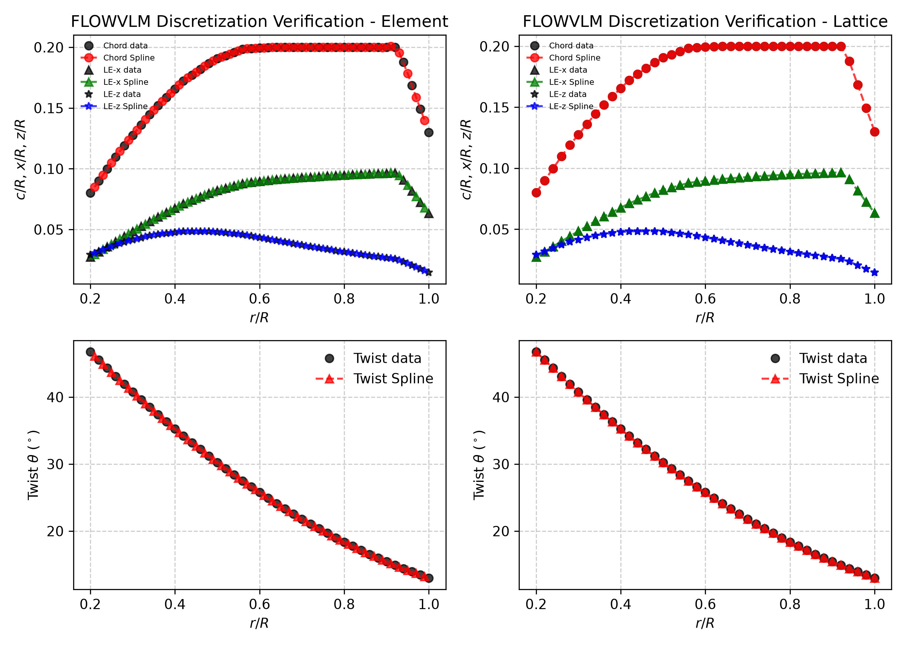
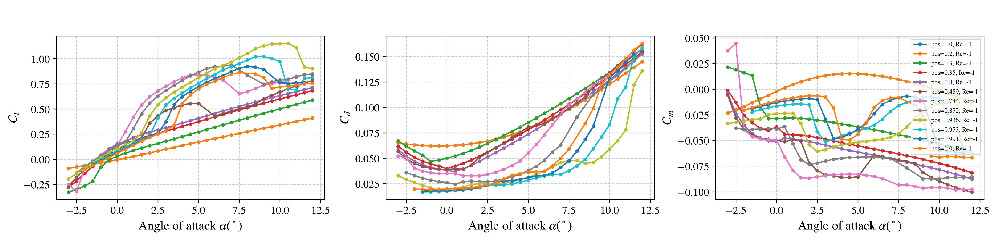

# vsp3-flowunsteady-pipeline

An automated Python pipeline that transfers parametric propeller geometry directly from **OpenVSP** into **FLOWUnsteady**, turning a `.bem`/`.vsp3` geometry pair into a ready-to-run, high-fidelity Julia simulation script — no manual re-modeling required.

The pipeline has been validated end-to-end: its output geometry is confirmed to match OpenVSP's own native mesh, and its aerodynamic predictions have been cross-checked against VSPAERO. See [Validation & Debugging Journey](#validation--debugging-journey) below for the full methodology, every bug that was found and fixed along the way, and the final numbers.

---

## Repository Structure

```text
├── bem_vsp3_to_flowunsteady.py     # Main pipeline: .bem + .vsp3 -> ready-to-run FLOWUnsteady .jl script
│
├── tools/                          # Validation & comparison utilities (see "Tools Reference" below)
│   ├── openvsp_prop_to_vtk.py          # Extract a VTK camber-surface mesh from an OpenVSP DegenGeom export
│   ├── compare_vsp_flowunsteady_vtk.py # Compare that mesh against FLOWUnsteady's own rotor VTK
│   ├── openvsp_convergence_sweep.py    # Automate an OpenVSP mesh-convergence study (tessellation sweep)
│   └── convergence_analysis.py         # Analyze/plot the convergence sweep results
│
├── examples/propellor02/           # A complete worked example: a 3-blade, D=0.3 m propeller
│   ├── propellor02.bem                 # Input: OpenVSP blade-element export
│   ├── propellor02.vsp3                # Input: OpenVSP model file
│   │
│   ├── openvsp/                        # OpenVSP / VSPAERO native outputs
│   │   ├── propellor02.vspaero             # VSPAERO case setup (flow conditions, Re, stall model)
│   │   ├── propellor02.polar               # VSPAERO's aerodynamic result summary
│   │   ├── propellor02_DegenGeom.csv       # Geometry export used for the VTK comparison
│   │   └── propellor02_DegenGeom.m
│   │
│   ├── flowunsteady/                   # FLOWUnsteady native outputs
│   │   ├── propellor02.jl                  # The generated, ready-to-run Julia script
│   │   ├── propellor02_bladetable.csv
│   │   ├── propellor02_chorddist.csv
│   │   ├── propellor02_heightdist.csv
│   │   ├── propellor02_pitchdist.csv
│   │   ├── propellor02_skewdist.csv
│   │   ├── propellor02-propeller_convergence.csv   # CT/CQ/eta time history from the simulation
│   │   └── airfoils/                       # Per-station airfoil contours + XFOIL polars
│   │
│   ├── paraview/                       # Interactive 3D geometry comparison
│   │   ├── Paraview_Comparison.gltf        # OpenVSP mesh vs. FLOWUnsteady mesh, overlaid
│   │   └── buffer*.bin                     # (glTF binary data - keep alongside the .gltf)
│   │
│   └── flowunsteady_raw_run/           # Local-only: the full raw simulation output (gitignored;
│                                        # regenerate by running the .jl script yourself)
│
├── docs/                            # Pipeline_Abstract_and_Propeller_Validation_Report.docx
├── assets/                          # Images used in this README
├── .gitignore
└── README.md
```

---

## Background

**[OpenVSP](https://openvsp.org/)** is NASA's open-source parametric aircraft geometry tool. It's widely used for rapid conceptual design and includes VSPAERO, a fast panel/vortex-lattice solver for preliminary aerodynamic analysis.

**[FLOWUnsteady](https://flow.byu.edu/FLOWUnsteady/)** is a high-fidelity viscous vortex particle method (VPM) solver developed by the BYU FLOW Lab. Unlike panel methods, it resolves wake contraction and unsteady aerodynamic effects directly, without relying on empirical wake models — making it especially valuable for propeller and rotor analysis where wake behavior drives performance.

This pipeline bridges the two: design and iterate quickly in OpenVSP, then validate with FLOWUnsteady's higher-fidelity physics — without redoing the geometry by hand.

---

## How the Pipeline Works

1. **Parse the `.bem` file** — extracts the blade element planform: chord, twist, sweep, and height distributions along the span.
2. **Parse the `.vsp3` file** — extracts the exact closed-form NACA 4-digit airfoil coordinates used at each spanwise section, plus the propeller's feather-axis parameters (`FeatherAxisXoC`, `FeatherOffsetXoC`), ensuring the translated geometry matches the OpenVSP model precisely.
3. **Automated XFOIL daemon** — for each spanwise station, the pipeline:
   - Estimates the local Reynolds number from the blade's *real* per-station chord and the operating conditions
   - Runs XFOIL automatically across the required angle-of-attack range
   - Falls back through a retry chain for angles where XFOIL fails to converge
   - Formats the resulting polars into the exact structure FLOWUnsteady expects
4. **Pre-flight safety checks** — before any XFOIL runs are launched, the geometry is scanned for issues that would waste computation time or produce bad polars:
   - Excessively thick root sections
   - Thin or high-camber tip sections
   - Abrupt spanwise geometric jumps between adjacent stations
5. **Assembly** — all airfoil contours, polars, and blade geometry (chord/twist/sweep/height, correctly referenced to the leading edge) are assembled into a single, ready-to-run `.jl` script for FLOWUnsteady.



### Key CLI options

| Option | Purpose |
|---|---|
| `-o, --outdir` | Output directory |
| `--n-elements` | Number of blade elements (`n=` in `generate_rotor`) |
| `--blade-r` | Geometric element-spacing expansion ratio |
| `--spline-s` / `--spline-k` | Spline smoothing controls for the chord/twist/sweep/height fits (default: `spline-s=0.0`, i.e. exact interpolation through the real table — see "Bugs Fixed" below for why) |
| `--trim-tip-chord-below` | Floor near-zero tip chord values, if your blade table contains any |

---

## Installation and Requirements

| Requirement | Notes |
|---|---|
| Python 3 | Core pipeline runtime |
| `numpy` | Geometry and numerical processing |
| XFOIL | Must be installed separately; update `XFOIL_PATH` in the script to point to your local XFOIL executable |
| FLOWUnsteady | Requires a working Julia environment with FLOWUnsteady installed |

---

## Usage Example

```bash
python bem_vsp3_to_flowunsteady.py examples/propellor02/propellor02.bem examples/propellor02/propellor02.vsp3 -o examples/propellor02/flowunsteady_raw_run
```

This produces, in the output directory:
- `.dat` airfoil contour files for each spanwise station
- `_polar.csv` files containing the XFOIL-generated aerodynamic polars
- A final assembled `.jl` script, ready to run directly in FLOWUnsteady



---

## Validation & Debugging Journey

This pipeline's output was validated two independent ways against the same OpenVSP model: **geometrically** (does FLOWUnsteady build the same physical blade shape OpenVSP describes?) and **aerodynamically** (does FLOWUnsteady's predicted thrust/torque/efficiency agree with VSPAERO's?). Both checks surfaced real bugs, which are documented below along with the methodology, so the comparison can be reproduced or extended to a new propeller.

### Step 1 — Extract a real mesh from OpenVSP

FLOWUnsteady is a meshless solver (a vortex particle method), so there's no traditional volume mesh to compare directly. Instead, the comparison uses OpenVSP's own **DegenGeom** export — specifically its `PLATE` representation, which is the true mean-camber surface (the geometric midpoint between the upper and lower airfoil surface at every span/chord station):

```bash
python tools/openvsp_prop_to_vtk.py examples/propellor02/openvsp/propellor02_DegenGeom.csv --outdir examples/propellor02/openvsp --blade 0
```

This reads the `xxCamber/xyCamber/xzCamber` columns from the DegenGeom CSV and writes a proper VTK `STRUCTURED_GRID` mesh of the blade's camber surface — openable directly in ParaView.

### Step 2 — Compare it against FLOWUnsteady's own rotor geometry

FLOWUnsteady writes its own blade geometry as a VTK file (`..._Rotor_Blade1_vlm_*.vtk`) every time a rotor is generated — a single-chordwise-strip lifting-line lattice (leading-edge line + trailing-edge line, connected into panels). `tools/compare_vsp_flowunsteady_vtk.py` parses both files and compares them *without* assuming they share a coordinate convention:

```bash
python tools/compare_vsp_flowunsteady_vtk.py \
    --vsp examples/propellor02/openvsp/camber_surface_blade0.vtk \
    --fu  examples/propellor02/flowunsteady_raw_run/propellor02-propeller/propellor02-propeller_Rotor_Blade1_vlm_0.vtk \
    --outdir examples/propellor02/openvsp
```

It automatically:
- detects which coordinate axis is "radius" (span) in each file,
- detects whether each file references its coordinates to the leading edge or to mid-chord (OpenVSP and FLOWUnsteady use *different* conventions by default — see Bug #1 below),
- computes chord length and twist angle at matching span stations and reports the agreement,
- solves a best-fit rotation/reflection between the two files' local coordinate planes, and
- writes an aligned copy of the OpenVSP mesh, rotated into FLOWUnsteady's frame, ready to overlay.

### Step 3 — Visual confirmation in ParaView
 
The aligned OpenVSP mesh and FLOWUnsteady's own mesh were loaded together in ParaView to visually confirm the fit — this comparison is saved as an interactive 3D scene:
 [🔍 Open interactive 3D view](https://kitware.github.io/paraview-glance/app/?name=Paraview_01.vtkjs&url=https://kalki-iitbhu.github.io/vsp3-flowunsteady-pipeline/examples/propellor02/paraview/Paraview_01.vtkjs) — rotate/inspect both meshes overlaid directly in your browser (no software needed).
 
The raw scene file is also available directly: [`examples/propellor02/paraview/Paraview_Comparison.gltf`](examples/propellor02/paraview/Paraview_Comparison.gltf) (open with any glTF-compatible viewer, e.g. ParaView itself, Blender, or a desktop model viewer).

### Bugs found and fixed

Four real bugs were found this way and fixed in the conversion pipeline:

1. **Feather-axis reference mismatch.** OpenVSP's `Rake`/`Skew` columns in the `.bem` export are referenced to the propeller's *feather axis* (`FeatherAxisXoC`, often not the leading edge — confirmed at `0.5`, i.e. mid-chord, for this test propeller), while FLOWUnsteady's `generate_rotor` expects `sweepdist`/`heightdist` referenced to the **leading edge**. The script now reads `FeatherAxisXoC`/`FeatherOffsetXoC` from the `.vsp3` and corrects for this automatically (`apply_feather_axis_correction`).
2. **Julia float/int type bug.** Whole-number `Float64` values (e.g. `blade_r = 1.0`) were being written into the generated `.jl` script as bare integers (`1`), which Julia parses as `Int64` — causing a `TypeError` in `generate_rotor`. Fixed in `_fmt()`.
3. **Chord-curve parsing failure.** The original chord-curve lookup assumed a `<ParmContainer Name="Chord">` spline block that doesn't exist in this `.vsp3` layout, silently falling back to a flat `chord/R = 0.15` assumption for every station's Reynolds-number estimate. This was wrong by 5-12x across the span and biased every XFOIL polar's `Cd`/`Cl`. Fixed to read the real per-station `Chord` value directly from each XSec block.
4. **Unwanted chord-table smoothing.** `generate_rotor`'s default spline smoothing (`spline_s`) distorted the chord distribution near the tip, getting *worse* with more blade elements rather than better. Now defaults to `spline_s=0.0` (exact interpolation through the real table).

After these fixes, FLOWUnsteady's rotor geometry matches the OpenVSP DegenGeom mesh to within numerical precision — chord length, twist, and (once the pitch-axis convention difference above is accounted for) absolute position all agree.

### OpenVSP mesh convergence check

Before trusting the OpenVSP side of the comparison, a tessellation convergence study confirmed the DegenGeom export itself was fine enough — not under-resolved at the tip, where chord and twist change fastest:

```bash
python tools/openvsp_convergence_sweep.py examples/propellor02/propellor02.vsp3 --outdir sweep_output --tess-min 8 --tess-max 120 --n-levels 30
python tools/convergence_analysis.py --manifest sweep_output/manifest.csv --rR 0.95
```

Result: tip-region chord length converges to well under 1% change by `Tess_U ≈ 30-40`, confirming the export used for comparison was adequately resolved.

### Aerodynamic validation (vs. VSPAERO)

A 3-bladed, D = 0.3 m propeller was evaluated at **J = 0.4** (9,200 RPM, V∞ = 18.4 m/s), comparing FLOWUnsteady's predicted thrust/torque/efficiency against VSPAERO's.

**Important caveat discovered during this comparison**: VSPAERO's *default* viscous/stall-model settings (`ReCref = 10,000,000`, `Clo2D = 0`) do not reflect this propeller's real operating Reynolds number (~2-3×10⁵, roughly 45x lower than the default) or its real cambered airfoil sections. With those defaults, VSPAERO's stall clamp barely engaged and it substantially over-predicted thrust at the blade's aggressive root pitch angle (46.75°). These settings were corrected (`ReCref ≈ 220,000`, computed from the reference chord and 75%-radius blade speed; `Clo2D` set from the real XFOIL-measured zero-angle lift) before this final comparison:

| Quantity | VSPAERO (corrected settings) | FLOWUnsteady | % diff |
|---|---|---|---|
| CT | 0.1460 | 0.1654 | 13.2% |
| CQ | 0.0190 | 0.0209 | 10.2% |
| **Efficiency (η)** | **0.4901** | **0.5037** | **2.8%** |

### Known remaining gap

CT and CQ individually still differ from VSPAERO by ~10-13%, most likely reflecting genuine fidelity differences between FLOWUnsteady's blade-element + real XFOIL polars + free unsteady wake, versus VSPAERO's VLM with an empirical global stall-clamp — not a remaining bug in the conversion pipeline. The real `CLmax` for this airfoil has not yet been directly measured (the XFOIL angle-of-attack sweep needs extending past its current +12° cutoff, where lift was still rising) for a tighter VSPAERO-side check.

---

## Tools Reference

All four scripts in `tools/` are standalone and reusable on any new OpenVSP/FLOWUnsteady propeller pair, not specific to the `propellor02` example.

| Script | Purpose | Example |
|---|---|---|
| `openvsp_prop_to_vtk.py` | Extract a camber-surface VTK mesh from an OpenVSP DegenGeom CSV export | `python tools/openvsp_prop_to_vtk.py <file>_DegenGeom.csv --outdir ./out` |
| `compare_vsp_flowunsteady_vtk.py` | Compare an OpenVSP camber mesh against a FLOWUnsteady rotor VTK; auto-detects coordinate convention and writes an aligned overlay mesh | `python tools/compare_vsp_flowunsteady_vtk.py --vsp <camber>.vtk --fu <rotor>_vlm_0.vtk --outdir ./out` |
| `openvsp_convergence_sweep.py` | Drive OpenVSP's Python API to sweep spanwise tessellation and export a DegenGeom CSV at each level | `python tools/openvsp_convergence_sweep.py <file>.vsp3 --outdir ./sweep --tess-min 8 --tess-max 120 --n-levels 30` |
| `convergence_analysis.py` | Read the tessellation sweep's CSVs and report/plot when the geometry has converged | `python tools/convergence_analysis.py --manifest ./sweep/manifest.csv --rR 0.95` |

`openvsp_convergence_sweep.py` requires OpenVSP's Python API (`import openvsp`) and must be run from the Python environment linked to your OpenVSP installation.

---

## License

This project is licensed under the MIT License.
See the [LICENSE](LICENSE) file for details.
