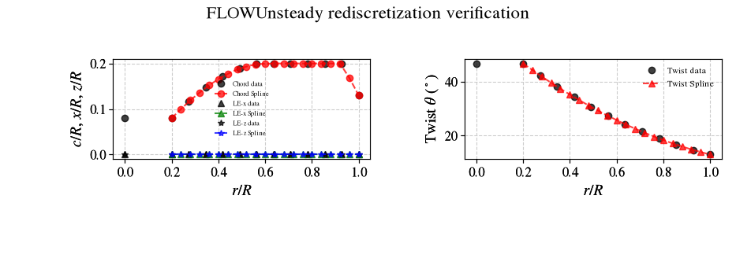
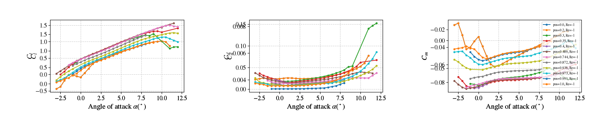
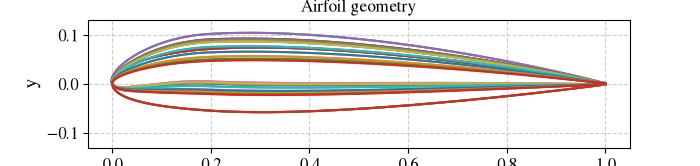
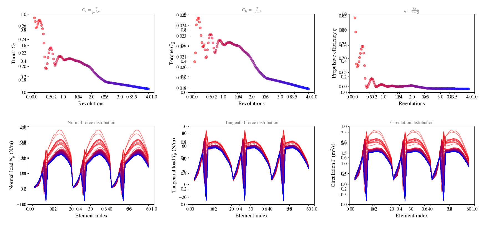

# vsp3-flowunsteady-pipeline

An automated Python pipeline that transfers parametric propeller geometry directly from **OpenVSP** into **FLOWUnsteady**, turning a `.bem`/`.vsp3` geometry pair into a ready-to-run, high-fidelity Julia simulation script — no manual re-modeling required.

---

## Background

**[OpenVSP](https://openvsp.org/)** is NASA's open-source parametric aircraft geometry tool. It's widely used for rapid conceptual design and includes VSPAERO, a fast panel/vortex-lattice solver for preliminary aerodynamic analysis.

**[FLOWUnsteady](https://flow.byu.edu/FLOWUnsteady/)** is a high-fidelity viscous vortex particle method (VPM) solver developed by the BYU FLOW Lab. Unlike panel methods, it resolves wake contraction and unsteady aerodynamic effects directly, without relying on empirical wake models — making it especially valuable for propeller and rotor analysis where wake behavior drives performance.

This pipeline bridges the two: design and iterate quickly in OpenVSP, then validate with FLOWUnsteady's higher-fidelity physics — without redoing the geometry by hand.

---

## How the Pipeline Works

1. **Parse the `.bem` file** — extracts the blade element planform: chord, twist, sweep, and height distributions along the span.
2. **Parse the `.vsp3` file** — extracts the exact closed-form NACA 4-digit airfoil coordinates used at each spanwise section, ensuring the translated geometry matches the OpenVSP model precisely.
3. **Automated XFOIL daemon** — for each spanwise station, the pipeline:
   - Estimates the local Reynolds number from the blade geometry and operating conditions
   - Runs XFOIL automatically across the required angle-of-attack range
   - Falls back through a retry chain for angles where XFOIL fails to converge
   - Formats the resulting polars into the exact structure FLOWUnsteady expects
4. **Pre-flight safety checks** — before any XFOIL runs are launched, the geometry is scanned for issues that would waste computation time or produce bad polars:
   - Excessively thick root sections
   - Thin or high-camber tip sections
   - Abrupt spanwise geometric jumps between adjacent stations
5. **Assembly** — all airfoil contours, polars, and blade geometry are assembled into a single, ready-to-run `.jl` script for FLOWUnsteady.



---

## Installation and Requirements

| Requirement | Notes |
|---|---|
| Python 3 | Core pipeline runtime |
| `numpy` | Geometry and numerical processing |
| XFOIL | Must be installed separately; update `XFOIL_PATH` in the script to point to your local XFOIL executable |
| FLOWUnsteady | Requires a working Julia environment with FLOWUnsteady installed |

---

## Repository Structure

```text
├── assets/                 # Visualizations, diagrams, and README images
├── docs/                   # Validation report (Pipeline_Abstract_and_Propeller_Validation_Report.docx)
├── examples/               # Sample validation cases (propellor02 geometry and output files)
├── .gitignore
├── README.md
└── bem_vsp3_to_flowunsteady.py  # Main pipeline entry script
```

---

## Usage Example

```bash
python bem_vsp3_to_flowunsteady.py examples/propellor02/propellor02.bem examples/propellor02/propellor02.vsp3 -o examples/propellor02/output
```

This command runs the full pipeline on the sample `propellor02` geometry and produces, in the output directory:

- `.dat` airfoil contour files for each spanwise station
- `_polar.csv` files containing the XFOIL-generated aerodynamic polars
- A final assembled `.jl` script, ready to run directly in FLOWUnsteady



---

## Aerodynamic Validation

A 3-bladed, D = 0.3 m propeller was evaluated at **J = 0.4** (9,200 RPM, V∞ = 18.4 m/s), comparing the OpenVSP/VSPAERO result against the FLOWUnsteady simulation produced by this pipeline:

| Metric | VSPAERO | FLOWUnsteady | Difference |
|---|---|---|---|
| Thrust coefficient (Ct) | 0.1960 | 0.1867 | ~5.0% |
| Torque coefficient (Cq) | 0.0213 | 0.0203 | ~4.9% |
| Efficiency (η) | 58.56% | 58.50% | <0.1% |



**Interpretation:** The near-perfect agreement in efficiency (<0.1% difference) validates that the geometry translation between OpenVSP and FLOWUnsteady is accurate — the blade shape, twist, and airfoil sections are being carried over correctly. The ~5% difference in thrust and torque coefficients is expected and physically meaningful: FLOWUnsteady's vortex particle method captures wake contraction, which lowers the effective angle of attack seen by the blade relative to VSPAERO's simpler wake model. This is a signature of higher-fidelity aerodynamics, not an error in the pipeline.



---

## License

Add your license of choice here.
